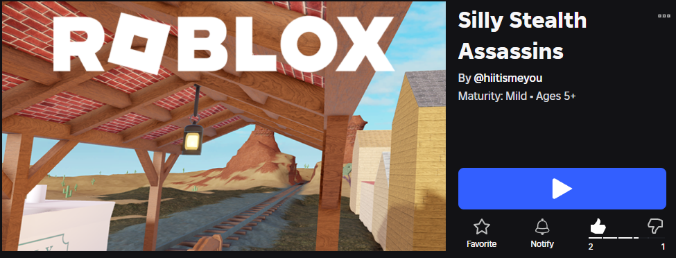

# 😱🫣 Silly Stealth Assassins

Silly Stealth Assassins is a fun and strategic Roblox game where players are tasked with eliminating every other player and becoming the last one standing **BUT there’s a catch**.

All players are visually indistinguishable from each other *and* from the NPCs roaming the map. To survive, players must blend in, mimic NPC behavior, and carefully observe their surroundings to identify who might secretly be another player. Someone behind you could be a peaceful NPC… or a player waiting for the right moment to strike.

The game takes inspiration from the classic Mineplex (Minecraft) minigame **Sneaky Assassins**, which similarly revolved around players disguising themselves as NPCs while navigating a shared space. Our goal was to revive this concept using Roblox’s platform while expanding on the original idea with new mechanics that introduce more action, strategy, and unpredictability.

## Repository Purpose

This repository serves as a mirror of how the game is structured inside Roblox Studio. It contains a copy of all the game scripts, and is organized to be able to put into Roblox Studio. 

## Project Structure

- `place/`  
  Optional exported `.rbxlx` snapshot of the game world.

- `src/`  
  A folder-by-folder mirror of Roblox Studio services:
  - Workspace (NPC logic, pathfinding, environment scripts)
  - ServerScriptService (game state, pickups, progression)
  - ReplicatedStorage (shared data modules)
  - ServerStorage (server-only weapon logic)
  - StarterPack / StarterPlayer (player tools and client scripts)

## How to Run

1. Visit the Roblox website.
2. Find Silly Stealth Assassins on the search tab. 
(Or visit this link https://www.roblox.com/games/120423619100278/Silly-Stealth-Assassins)
3. Press Play
4. Go through Roblox installation
5. Done!

## Notes
- This repository mirrors scripts only.
- Models, Parts, animations, and assets remain inside Roblox Studio.
- Script filenames and folder paths match their Roblox Explorer locations.
